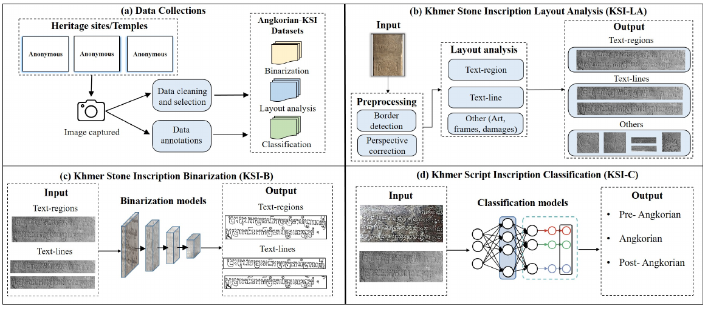
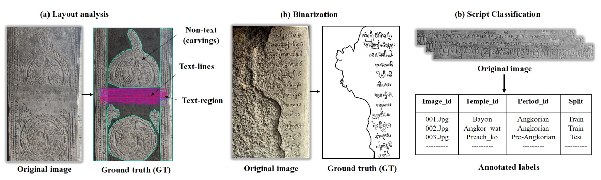
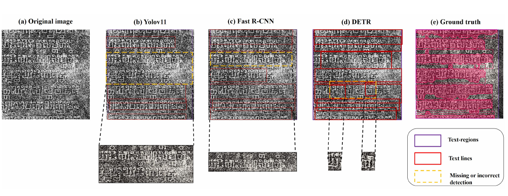
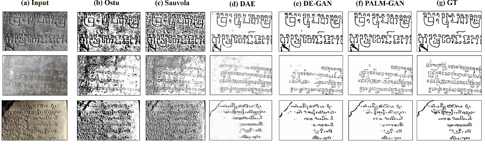
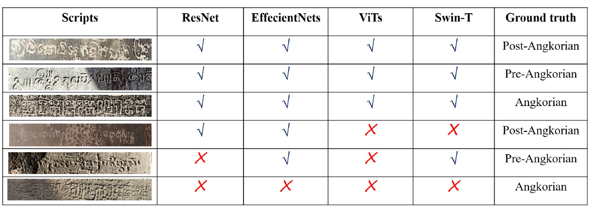

# Angkorian-KSI

[](https://doi.org/10.1007/978-3-032-36039-7_23)
[](https://icdar2026.org/)
[](https://doi.org/10.1007/978-3-032-36039-7_23)
[](#ksi-small-coming-soon)
[](#data-access-and-use-restrictions)

## A Multi-task Benchmark for Khmer Stone Inscription Analysis

Official repository for **Angkorian-KSI: A Multi-task Benchmark for Khmer Stone Inscription Analysis**, published in the proceedings of the **18th International Conference on Document Analysis and Recognition (ICDAR 2026, Vienna, Austria)**.

> **Publication status:** First published online on **24 August 2026** in *Document Analysis and Recognition - ICDAR 2026*, Lecture Notes in Computer Science, volume 16974, pages 387-404. Springer’s official bibliographic citation uses the publication year **2027**.

**Paper:** [Springer](https://link.springer.com/chapter/10.1007/978-3-032-36039-7_23) | [DOI](https://doi.org/10.1007/978-3-032-36039-7_23) | [Angkorian-AI](https://angkorianai.github.io/)

## Overview

Khmer stone inscriptions are primary records of Cambodia’s linguistic, historical, religious, and cultural heritage. Automated analysis is difficult because carved stone differs fundamentally from planar documents: relief-induced shadows, erosion, biological growth, surface damage, irregular illumination, complex stone texture, and gradual script evolution all obscure the inscription structure.

**Angkorian-KSI** is the first multi-task benchmark designed specifically for automated Khmer stone inscription analysis. It was curated from in-situ captures collected across **10 temple sites** within a UNESCO World Heritage archaeological region in Cambodia and supports three connected tasks:

- **KSI-LA:** layout analysis of text regions, text lines, and applicable non-text elements.
- **KSI-B:** binary text-mask extraction from degraded stone surfaces.
- **KSI-C:** historical script-period classification across Pre-Angkorian, Angkorian, and Post-Angkorian periods.

## Benchmark Workflow



*Figure 3 from the paper. The workflow connects in-situ acquisition and annotation with layout analysis, binarization, and historical script-period classification.*

The annotation pipeline uses three quality-control stages:

1. Automatic initialization using classical image processing and detection-assisted preprocessing.
2. Manual refinement with polygon-based and pixel-accurate annotation tools.
3. Expert verification of degraded, ambiguous, or partially broken inscriptions.

## Benchmark Tasks

| Task | Input | Ground truth | Primary evaluation |
| --- | --- | --- | --- |
| **KSI-LA** | Full inscription images | Text-region, text-line, and applicable non-text boxes | Per-class AP@0.5 and mAP@0.5 |
| **KSI-B** | Text-region and text-line crops | Pixel-level binary masks | Precision, recall, F1, PSNR, and DRD |
| **KSI-C** | Full images and text-region crops | Historical period labels | Accuracy and macro-F1 |

## Dataset Statistics

| Component | Quantity | Annotation type |
| --- | ---: | --- |
| Full inscription images | 230 | Layout and metadata |
| Annotated text regions | 760 | Polygon masks |
| Annotated text lines | 2,733 | Polygon masks |
| Binarization masks | 3,493 | Binary masks |
| Script-period labels | 534 | Page/region labels |
| Temple sites | 10 | Site metadata |

### Page-level split

| Split | Pre-Angkorian | Angkorian | Post-Angkorian | Total |
| --- | ---: | ---: | ---: | ---: |
| Train (70%) | 28 | 112 | 21 | 161 |
| Validation (15%) | 6 | 24 | 4 | 34 |
| Test (15%) | 6 | 24 | 5 | 35 |
| **All** | **40** | **160** | **30** | **230** |

Splits are assigned at the full-image level. Temple-level separation is enforced whenever sufficient samples are available, and every derived region or line crop inherits the split of its source image.

## Annotation Examples



*Figure 4 from the paper. Representative structural, binarization, and script-period annotations.*

Ambiguous regions are handled conservatively. Annotators do not reconstruct unreadable characters or invent missing stroke boundaries when the available visual evidence is insufficient.

## Experimental Setup

- **Hardware:** two NVIDIA RTX A6000 GPUs.
- **Optimization:** AdamW, initial learning rate 1 × 10^-4, weight decay 1 × 10^-4, batch size 16, and 100 epochs.
- **Model selection:** validation mAP@0.5 for KSI-LA, validation F1 for KSI-B, and validation macro-F1 for KSI-C.
- **Binarization training:** pixel-wise binary cross-entropy, optionally combined with Dice loss.

## Benchmark Results

All results below are reproduced from the published paper and use the official Angkorian-KSI splits.

### KSI-LA: Layout Analysis

| Method | Text-region AP@0.5 | Text-line AP@0.5 | Other AP@0.5 | mAP@0.5 |
| --- | ---: | ---: | ---: | ---: |
| YOLOv8 | 80.12 | 60.34 | 40.25 | 60.24 |
| YOLOv11 | 84.78 | 67.91 | 48.37 | 67.02 |
| Faster R-CNN | 88.43 | 72.18 | 52.46 | 71.02 |
| **DETR** | **92.67** | **79.84** | **57.63** | **76.71** |

DETR obtains the strongest overall layout result, while text-line and non-text detection remain more difficult because of dense line spacing, shadows, adjacent structures, and decorative carvings.



*Figure 5 from the paper. Qualitative comparison of YOLOv11, Faster R-CNN, DETR, and ground truth.*

### KSI-B: Binarization

| Method | Precision ↑ | Recall ↑ | F1 ↑ | PSNR ↑ | DRD ↓ |
| --- | ---: | ---: | ---: | ---: | ---: |
| Otsu | 0.18 | 0.51 | 0.23 | 12.0 | 18.7 |
| Sauvola | 0.22 | 0.44 | 0.28 | 12.6 | 17.5 |
| DAE | 0.61 | 0.53 | 0.57 | 17.8 | 8.9 |
| [DE-GAN](https://doi.org/10.1109/TPAMI.2020.3022406) | 0.78 | **0.72** | 0.75 | 21.9 | 4.6 |
| **[PALM-GAN](https://doi.org/10.1007/s10032-024-00472-z)** | **0.80** | **0.72** | **0.77** | **23.4** | **4.2** |

Learning-based approaches substantially outperform classical thresholding. PALM-GAN achieves the best F1, PSNR, and DRD, although faint strokes in heavily eroded regions remain challenging.



*Figure 6 from the paper. Comparison of Otsu, Sauvola, DAE, DE-GAN, PALM-GAN, and ground truth.*

### KSI-C: Script-period Classification

| Method | Page accuracy ↑ | Page macro-F1 ↑ | Region accuracy ↑ | Region macro-F1 ↑ |
| --- | ---: | ---: | ---: | ---: |
| ResNet50 | 0.82 | 0.76 | 0.84 | 0.80 |
| **EfficientNetB0** | **0.86** | **0.79** | **0.89** | **0.82** |
| ViT-B/16 | 0.71 | 0.67 | 0.75 | 0.71 |
| Swin-T | 0.76 | 0.71 | 0.80 | 0.74 |

EfficientNetB0 performs best at both page and region levels. Region-level evaluation is consistently stronger, indicating that full-image background texture and layout variation add noise to historical period recognition.

#### Region-level per-class F1

| Method | Pre-Angkorian | Angkorian | Post-Angkorian |
| --- | ---: | ---: | ---: |
| ResNet50 | 0.74 | 0.85 | 0.81 |
| **EfficientNetB0** | **0.77** | **0.88** | **0.83** |
| ViT-B/16 | 0.63 | 0.78 | 0.71 |
| Swin-T | 0.68 | 0.81 | 0.73 |



*Figure 7 from the paper. Correct and incorrect predictions across CNN and transformer-based classifiers.*

## Main Findings

- Carved stone creates a substantial domain gap relative to conventional ink-based document images.
- Global structural modeling benefits layout analysis; DETR achieves the strongest KSI-LA result.
- Learning-based binarization is substantially more robust than classical thresholding under stone texture and relief shading.
- CNN classifiers outperform the tested transformer classifiers in the limited-data KSI-C setting.
- Errors frequently involve heavily degraded samples and adjacent historical periods with gradual paleographic transitions.

## Release Status

| Resource | Status | Access |
| --- | --- | --- |
| Published paper | Available | [Springer / DOI](https://doi.org/10.1007/978-3-032-36039-7_23) |
| README and benchmark documentation | Available | This repository |
| **Angkorian-KSI-Small (KSI-Small)** public test sample | **Coming soon** | Limited public research sample |
| Evaluation code and official split files | Coming soon | This repository / Angkorian-AI |
| Complete Angkorian-KSI benchmark | Restricted | Approved cultural-heritage research only |

## KSI-Small: Coming Soon

**Angkorian-KSI-Small (KSI-Small)** will provide a limited public test sample from the benchmark so researchers can inspect the data structure, test input/output formats, and evaluate the basic workflow without receiving the restricted complete collection.

> [!CAUTION]
> **KSI-Small is an intentionally small, data-limited sample.** It does not represent the scale, diversity, or statistical reliability of the complete Angkorian-KSI benchmark. The results below are preliminary and diagnostic; they should not be treated as definitive model rankings or directly compared with the full-benchmark results reported above.

### Preliminary KSI-B Results on Angkorian-KSI-Small

Values are reported as **mean ± standard deviation** from the supplied experimental evaluation.

| Method | Family | Track | F ↑ | pseudo-F ↑ | PSNR ↑ | DRD ↓ | Seconds/image ↓ |
| --- | --- | --- | ---: | ---: | ---: | ---: | ---: |
| Otsu | Classical/global | Train-tuned | 0.155 ± 0.100 | 0.146 ± 0.113 | 2.867 ± 1.211 | 102.426 ± 34.817 | **0.0077 ± 0.0029** |
| Sauvola | Classical/local | Train-tuned | 0.141 ± 0.093 | 0.134 ± 0.121 | 6.163 ± 1.838 | 47.394 ± 25.265 | 0.0190 ± 0.0066 |
| Wolf-Jolion | Classical/local | Train-tuned | 0.140 ± 0.069 | 0.128 ± 0.094 | 6.367 ± 1.463 | 43.138 ± 17.313 | 0.0128 ± 0.0037 |
| SAE/DAE | Autoencoder | Zero-shot | 0.219 ± 0.152 | 0.205 ± 0.181 | 5.202 ± 2.326 | 62.703 ± 36.833 | 0.6111 ± 0.1908 |
| [DP-LinkNet](https://doi.org/10.3837/tiis.2021.05.011) | CNN | Zero-shot | 0.088 ± 0.149 | 0.097 ± 0.176 | **8.553 ± 0.941** | **22.851 ± 6.053** | 0.4786 ± 0.1635 |
| U-Net | CNN | Fine-tuned | 0.432 ± 0.140 | 0.452 ± 0.146 | 8.070 ± 0.973 | 26.704 ± 7.621 | 0.7294 ± 0.3370 |
| SAE/DAE | Autoencoder | Fine-tuned | 0.162 ± 0.138 | 0.164 ± 0.159 | 6.582 ± 1.497 | 42.426 ± 21.570 | 0.6135 ± 0.1927 |
| [DocDiff](https://doi.org/10.1145/3581783.3611730) | Diffusion | DIBCO zero-shot | 0.143 ± 0.117 | 0.139 ± 0.137 | 5.129 ± 1.606 | 59.892 ± 25.102 | 5.6917 ± 1.5151 |
| [DocEnTr](https://doi.org/10.1109/ICPR56361.2022.9956101) | Transformer | Zero-shot | 0.130 ± 0.120 | 0.129 ± 0.142 | 8.378 ± 1.505 | 24.756 ± 10.358 | 4.3325 ± 1.3583 |
| U-Net | CNN | DIBCO zero-shot | 0.134 ± 0.139 | 0.131 ± 0.157 | 8.538 ± 1.226 | 23.329 ± 8.245 | 0.7307 ± 0.2538 |
| [DocDiff](https://doi.org/10.1145/3581783.3611730) | Diffusion | Fine-tuned | 0.138 ± 0.025 | 0.136 ± 0.024 | 6.562 ± 0.476 | 38.300 ± 6.250 | 5.4655 ± 1.3868 |
| [DE-GAN](https://doi.org/10.1109/TPAMI.2020.3022406) | GAN | Zero-shot | 0.255 ± 0.179 | 0.247 ± 0.194 | 3.807 ± 2.385 | 89.525 ± 44.531 | 2.0661 ± 0.6800 |
| [DE-GAN](https://doi.org/10.1109/TPAMI.2020.3022406) | GAN generator | Fine-tuned | 0.487 ± 0.148 | 0.497 ± 0.153 | 7.769 ± 1.037 | 29.575 ± 9.899 | 1.9814 ± 0.6272 |
| [PALM-GAN](https://doi.org/10.1007/s10032-024-00472-z) | CNN-Transformer hybrid | Raw experimental | 0.476 ± 0.173 | 0.486 ± 0.168 | 7.779 ± 1.005 | 29.409 ± 9.681 | 1.9589 ± 0.6166 |
| **[PALM-GAN](https://doi.org/10.1007/s10032-024-00472-z)** | **CNN-Transformer hybrid** | **Fine-tuned** | **0.508 ± 0.165** | **0.519 ± 0.169** | 8.479 ± 0.904 | 26.762 ± 8.712 | 1.9495 ± 0.5920 |

**Metric directions:** higher values are better for F, pseudo-F, and PSNR; lower values are better for DRD and seconds per image. Bold metric values indicate the best reported mean for each metric. Results from different tracks should be interpreted within their respective adaptation settings.

#### Track definitions

- **Train-tuned:** classical method parameters were selected using the available KSI-Small training portion.
- **Zero-shot:** a pretrained model was evaluated without KSI-Small fine-tuning.
- **DIBCO zero-shot:** a DIBCO-domain model was evaluated without KSI-Small fine-tuning.
- **Fine-tuned:** the model was adapted using the limited KSI-Small training portion.
- **Raw experimental:** an experimental model configuration evaluated before KSI-Small fine-tuning.
#### Referenced Method Papers

- **DE-GAN:** Souibgui, M. A., and Kessentini, Y. [*DE-GAN: A Conditional Generative Adversarial Network for Document Enhancement*](https://doi.org/10.1109/TPAMI.2020.3022406). *IEEE Transactions on Pattern Analysis and Machine Intelligence*, 2022.
- **DocDiff:** Yang, Z., et al. [*DocDiff: Document Enhancement via Residual Diffusion Models*](https://doi.org/10.1145/3581783.3611730). *Proceedings of the 31st ACM International Conference on Multimedia*, 2023.
- **PALM-GAN:** Thuon, N., Du, J., Zhang, Z., Ma, J., and Hu, P. [*Generate, transform, and clean: the role of GANs and transformers in palm leaf manuscript generation and enhancement*](https://doi.org/10.1007/s10032-024-00472-z). *International Journal on Document Analysis and Recognition*, 2024.
- **DocEnTr:** Souibgui, M. A., et al. [*DocEnTr: An End-to-End Document Image Enhancement Transformer*](https://doi.org/10.1109/ICPR56361.2022.9956101). *26th International Conference on Pattern Recognition*, 2022.
- **DP-LinkNet:** Xiong, W., Jia, X., Yang, D., Ai, M., Li, L., and Wang, S. [*DP-LinkNet: A convolutional network for historical document image binarization*](https://doi.org/10.3837/tiis.2021.05.011). *KSII Transactions on Internet and Information Systems*, 15(5), 1778-1797, 2021.

## Data and leakage policy

### Training budget

All trainable **KSI-Small** experiments are limited to a maximum of **50 epochs**. Zero-shot evaluations do not perform KSI-Small training, while classical train-tuned methods use parameter selection rather than epoch-based learning. This 50-epoch cap applies only to the KSI-Small pilot experiments and is separate from the full-benchmark configuration reported in the published paper.

The supplied JPEG ground truths are converted to grayscale, resampled to source resolution when necessary with an area (`BOX`) filter, thresholded at 128, and stored as lossless PNG. Black is foreground and white is background.

KSI model selection uses recorded image-level folds, so patches from one inscription cannot cross train/validation boundaries. The selected model is refit on all ten training pairs before the single final test evaluation. External pretraining uses 166 DIBCO/H-DIBCO/PALM pairs, with the complete 2018 edition held out for validation. No KSI file appears in that external manifest.

Default foreground-aware augmentation includes synchronized reflection and small rotation plus brightness, contrast, color, gamma, smooth illumination, blur, sensor noise, and JPEG degradation. Masks receive only nearest-neighbor geometric transforms. Elastic and morphological transforms are excluded because they would alter annotated stroke structure.

## Important limitations

Patch extraction and augmentation do not increase the number of independent inscriptions. KSI-small has ten training and five test images, so this is a domain-transfer feasibility study rather than a population-level performance estimate. DocDiff is deliberately compute-capped at 256 sampled patches for few epochs; it validates the diffusion pipeline but is not a reproduction of the paper's million-iteration training schedule.

#### Preliminary observations

- Fine-tuned PALM-GAN achieves the highest F (**0.508 ± 0.165**) and pseudo-F (**0.519 ± 0.169**).
- Fine-tuned DE-GAN provides the second-highest F (**0.487 ± 0.148**) and pseudo-F (**0.497 ± 0.153**).
- Zero-shot DP-LinkNet records the highest PSNR (**8.553 ± 0.941**) and the lowest DRD (**22.851 ± 6.053**), despite its comparatively low F measures.
- Otsu remains the fastest method at **0.0077 ± 0.0029 seconds per image**.
- Fine-tuning substantially improves U-Net, DE-GAN, and PALM-GAN in this pilot, but does not consistently improve SAE/DAE or DocDiff.
- No method dominates every metric, demonstrating a trade-off between foreground-stroke agreement, image fidelity, distortion, and runtime.
Because KSI-Small contains limited data and restricted coverage of sites, historical periods, degradation patterns, and surface conditions, its scores may have high variance. The sample is intended for pipeline verification, format testing, and preliminary reproducibility checks—not for training data-hungry models or drawing broad performance conclusions.

The sample will be released separately with its own permitted-use notice. Availability of KSI-Small will **not** imply open access to, or redistribution rights for, the complete Angkorian-KSI benchmark.

## Data Access and Use Restrictions

> [!IMPORTANT]
> **The complete Angkorian-KSI benchmark is not an open or unrestricted dataset. Access and use are strictly limited to approved, non-commercial cultural-heritage research.**

Because the collection contains imagery acquired at protected heritage sites and is subject to site-level, ethical, and data-sharing conditions:

- Full benchmark access requires a reasonable academic request, research-purpose review, and explicit approval from the project team.
- Approved use must remain within the stated cultural-heritage research scope.
- Commercial use, resale, public re-hosting, and redistribution of the complete images or annotations are not permitted.
- Access approval does not transfer ownership or grant permission for any use beyond the approved project.
- Researchers must follow any additional attribution, reporting, security, and deletion conditions provided with approved access.

Public visibility of this repository, its documentation, paper figures, results, or KSI-Small does **not** grant access to the full benchmark and does **not** waive these restrictions.

Access announcements, documentation, and permitted public resources will be provided through the [Angkorian-AI project website](https://angkorianai.github.io/).

## Paper Information

- **Title:** Angkorian-KSI: A Multi-task Benchmark for Khmer Stone Inscription Analysis
- **Authors:** Nimol Thuon, Jun Du, Ranysakol Thuon, and Panhapin Theang
- **Venue:** Document Analysis and Recognition - ICDAR 2026
- **Series:** Lecture Notes in Computer Science, volume 16974
- **Pages:** 387-404
- **Publisher:** Springer, Cham
- **First published online:** 24 August 2026
- **DOI:** [10.1007/978-3-032-36039-7_23](https://doi.org/10.1007/978-3-032-36039-7_23)

## Citation

If Angkorian-KSI supports your research, please cite the published paper:

```bibtex
@inproceedings{thuon2027angkorian,
  author    = {Thuon, Nimol and Du, Jun and Thuon, Ranysakol and Theang, Panhapin},
  title     = {Angkorian-KSI: A Multi-task Benchmark for Khmer Stone Inscription Analysis},
  booktitle = {Document Analysis and Recognition -- ICDAR 2026},
  series    = {Lecture Notes in Computer Science},
  volume    = {16974},
  pages     = {387--404},
  publisher = {Springer},
  address   = {Cham},
  year      = {2027},
  doi       = {10.1007/978-3-032-36039-7_23}
}
```

## Project Team

| **Dr. Nimol Thuon** | Project lead;  nimol.thuon@gmail.com|


## Acknowledgements

This research was supported by the National Natural Science Foundation of China under Grant No. **U25A20409**. The authors thank the Khmer epigraphic experts who assisted with annotation verification and the contributors from Cambodia, China, and France who supported data organization, documentation, and benchmark preparation.

## Research Scope

Angkorian-KSI is part of a broader effort to advance low-resource historical document analysis and the responsible digital preservation of Khmer and Southeast Asian cultural heritage.
